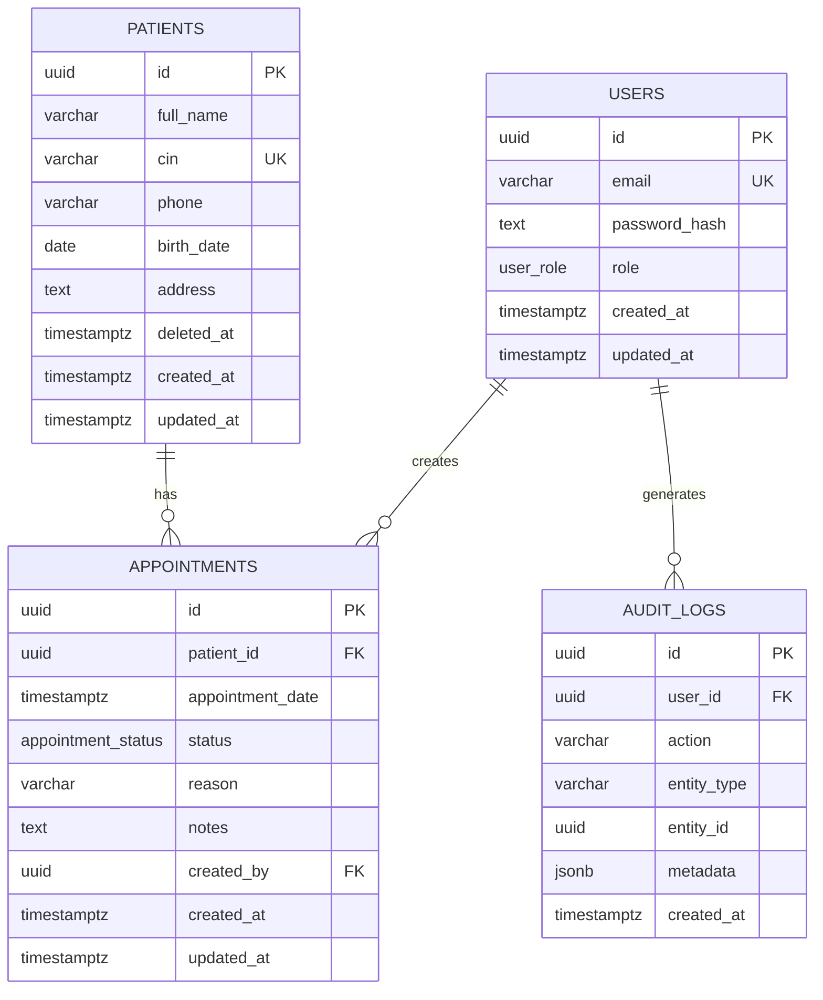

# ClinicFlow — Database Design

## ERD

## Relations

- `users 1-N appointments`: every appointment records the authenticated staff/admin user who created it. No N-N table is needed because one appointment has exactly one creator.
- `patients 1-N appointments`: a patient can have many appointments; each appointment belongs to one patient. No N-N relationship is required by the business scope.
- `users 1-N audit_logs`: audit entries optionally identify the actor who performed an action.

## Delete rules

- `appointments.patient_id -> patients.id ON DELETE RESTRICT`: medical/operational appointment history should not disappear because a patient row is removed. In practice the API uses soft-delete (`patients.deleted_at`), so the FK is an additional database safeguard.
- `appointments.created_by -> users.id ON DELETE RESTRICT`: a user who created historical appointments cannot be physically deleted while those records depend on that identity. User deactivation is intentionally outside the current scope.
- `audit_logs.user_id -> users.id ON DELETE SET NULL`: audit history should survive removal of a user record while retaining the event itself.

## Constraints and indexes

- UUID primary keys use PostgreSQL `gen_random_uuid()`.
- `users.email` and `patients.cin` are unique.
- Roles and appointment statuses use PostgreSQL enums.
- `created_at`/`updated_at` are present on all business tables; `audit_logs` only needs `created_at` because audit records are immutable.
- Search indexes: `patients(full_name)` and `patients(cin)`. `pg_trgm` GIN on `full_name` supports efficient `ILIKE '%term%'`; a B-tree on `cin` supports exact/prefix-oriented lookups.
- Appointment filters: indexes on `patient_id`, `appointment_date`, `status`, plus `(patient_id, appointment_date)` for the 30-minute conflict query.
- `deleted_at` enables patient soft-delete while excluding deleted patients from normal lists and dashboard counts.

## 30-minute rule

For a confirmation at `appointment_date = T`, another confirmed appointment for the same patient conflicts when its date is within the inclusive interval `[T - 30 minutes, T + 30 minutes]`. The current appointment is excluded during updates. The service runs the conflict check inside a transaction after acquiring a PostgreSQL advisory transaction lock derived from the patient UUID. This serializes confirmation/create operations for the same patient and closes the race window that a plain `SELECT` would leave open.

Exactly `30 minutes` is considered a conflict because the rule is inclusive (`<=`).
